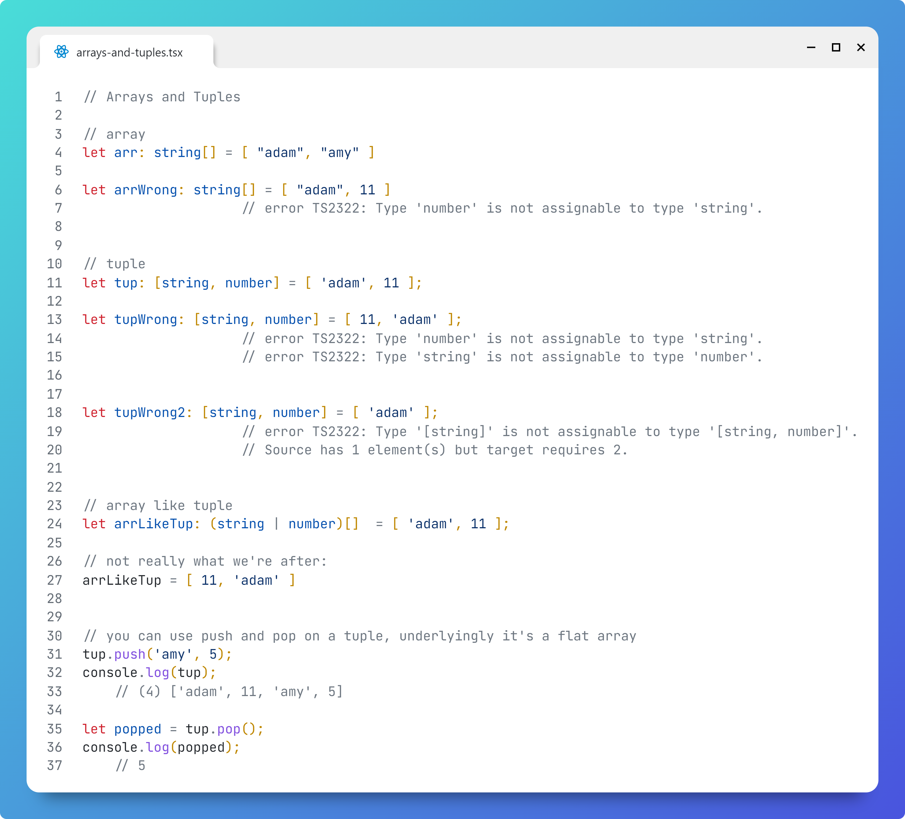

# Arrays and Tuples

## Question

What is the difference between an array and a tuple

## Answer

Array items must be of the same type, e.g.

```typescript
let arr: string[] = [ 'adam', 'amy' ];

let arrWrong: string[] = [ 'adam', 11 ];  
                // error TS2322: Type 'number' is not assignable to type 'string'.
```

A tuple has a set number of items and each item is of a specified type:

```typescript
let tup: [string, number] = [ 'adam', 11 ];

let tupWrong: [string, number] = [ 11, 'adam' ];
                    // error TS2322: Type 'number' is not assignable to type 'string'.
                    // error TS2322: Type 'string' is not assignable to type 'number'.

let tupWrong2: [string, number] = [ 'adam' ];
                    // error TS2322: Type '[string]' is not assignable to type '[string, number]'.
                    // Source has 1 element(s) but target requires 2.   

```

You could emulate a [string, number] tuple with an array, but it wouldn't be fully equivalent:

```typescript

let arrLikeTup: (string | number)[]  = [ 'adam', 11 ];

// not really what we're after:
arrLikeTup = [ 11, 'adam' ]
```


You can use `push` and `pop` on a tuple, underlyingly it's a flat array
```typescript
tup.push('amy', 5);
console.log(tup);
    // (4) ['adam', 11, 'amy', 5]

let popped = tup.pop();
console.log(popped);
    // 5
```


# Image
