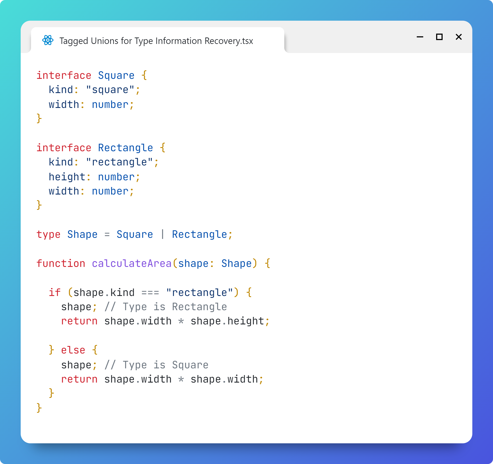

# Tagged Unions for Type Information Recovery at Runtime

## Problem

TypeScript type information (e.g. interfaces) does not exist at runtime.
You need a way of recovering that information at runtime.

## Solution

Tagged union

```typescript
interface Square {
    kind: 'square';
    width: number;
}

interface Rectangle {
    kind: 'rectangle';
    height: number;
    width: number;
}

type Shape = Square | Rectangle;

function calculateArea(shape: Shape) {
    if (shape.kind === 'rectangle') {
        shape; // Type is Rectangle
        return shape.width * shape.height;
    } else {
        shape; // Type is Square
        return shape.width * shape.width;
    }
}
```

## How It Works

The `kind` field represents the type in a way that won't be erased at runtime.

The `Shape` type is defined as a union (`|`) of the Square and Rectangle types. Effectively its `kind` field will be of type:
```typescript
kind: 'square' | 'rectangle'
```
i.e. it will allow either of those strings.


So now you can create an instance of a Rectangle like this:

```typescript
const rect : Rectangle = {
    kind: 'rectangle',
    width: 100,
    height: 200
};
```
or like this:
```typescript
const rect : Shape = {
    kind: 'rectangle',
    width: 100,
    height: 200
};
```

Either way, when you call the `calculateArea` function:
```typescript
calculateArea(rect)
```
it will not only be able to recognize that `rect` is of type `Rectangle`, but also the TypeScript parser will treat it as of that type when accessing its fields:

```typescript
function calculateArea(shape: Shape) {
    if (shape.kind === 'rectangle') {
        return shape.width * shape.height;  // <-- TypeScript knows shape is of type Rectangle
    } else {
        return shape.width * shape.width;
    }
}
```

# Image
