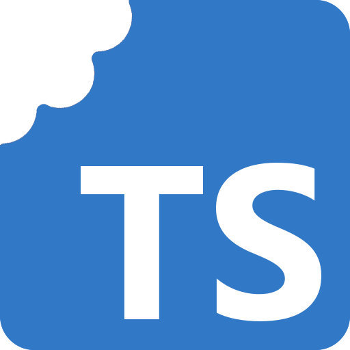
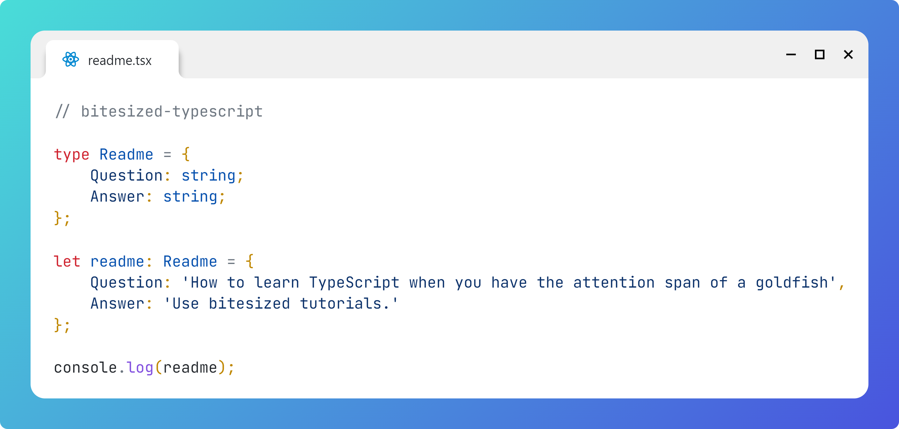

# Bitesized TypeScript Tutorials

# Question

How to learn TypeScript when you have the attention span of a goldfish?

# Answer

Use bitesized tutorials.

# How It Works

1. Clone the repo
2. Open in Visual Studio Code
3. View the bitesized tutorials

# Image

# Sources
1. [TypeScript Handbook](https://www.typescriptlang.org/docs/handbook/)
2. [Effective TypeScript](https://effectivetypescript.com/)

