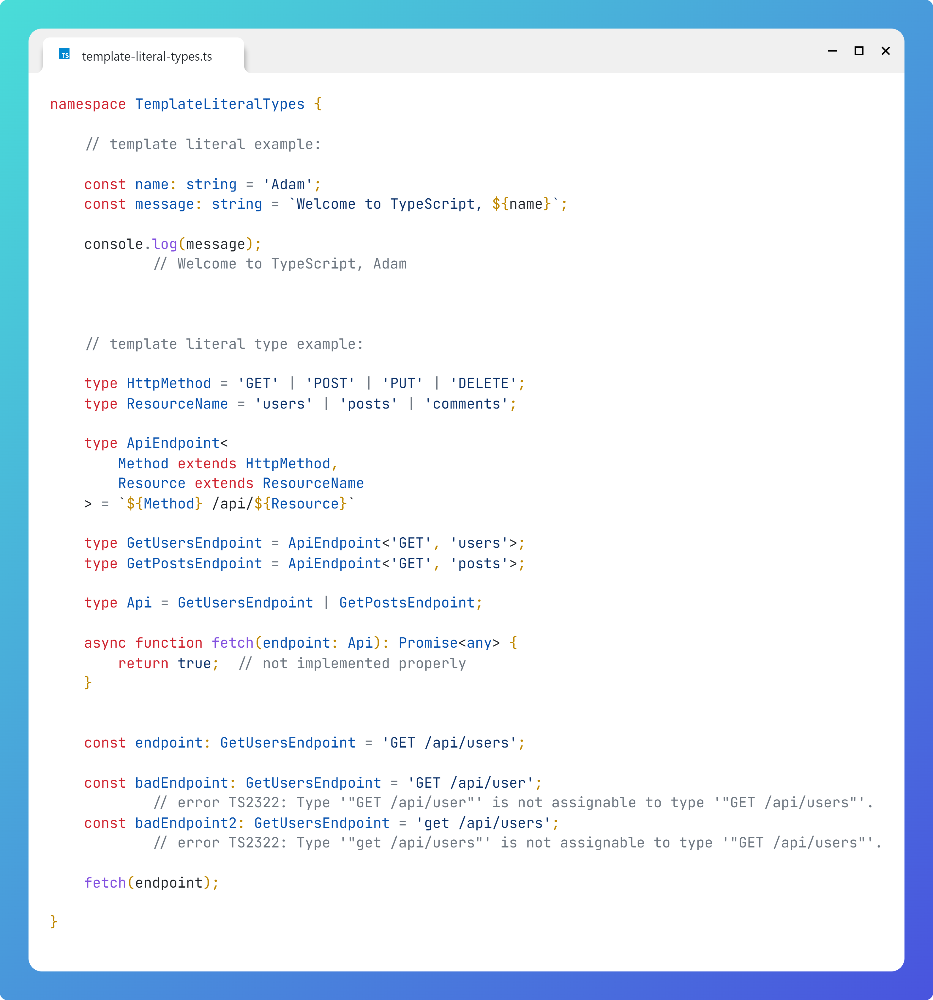

# Template Literal Types

## Question

What are template literal types and how can they be used?

## Answer

Template literal example:

```typescript
const yourName: string = 'Adam';
const message: string = `Welcome to TypeScript, ${yourName}`;

console.log(message);
        // Welcome to TypeScript, Adam
```


A template literal type example could be:
```typescript
   type HttpMethod = 'GET' | 'POST' | 'PUT' | 'DELETE';
    type ResourceName = 'users' | 'posts' | 'comments';

    type ApiEndpoint<
        Method extends HttpMethod,
        Resource extends ResourceName
    > = `${Method} /api/${Resource}`  // <-- this is a template literal type
```

Now I can create type aliases for specific endpoints, and a union for the whole API:
```typescript

    type GetUsersEndpoint = ApiEndpoint<'GET', 'users'>;
    type GetPostsEndpoint = ApiEndpoint<'GET', 'posts'>;

    type Api = GetUsersEndpoint | GetPostsEndpoint;
```

Now the type system will detect bad endpoints:
```typescript
    const endpoint: GetUsersEndpoint = 'GET /api/users';

    const badEndpoint: GetUsersEndpoint = 'GET /api/user';
            // error TS2322: Type '"GET /api/user"' is not assignable to type '"GET /api/users"'.
    const badEndpoint2: GetUsersEndpoint = 'get /api/users';
            // error TS2322: Type '"get /api/users"' is not assignable to type '"GET /api/users"'.
```


# Image
