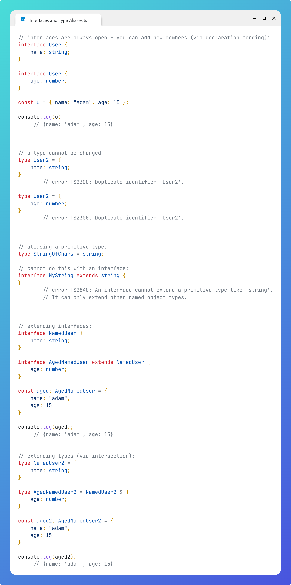

# Interfaces and Type Aliases

## Question

What are the differences between interfaces and type aliases?

## Answer

1. Interfaces are always open - you can add new members (via declaration merging):

```typescript
interface User {
    name: string;
}

interface User {
    age: number;
}

const u = { name: "adam", age: 15 };

console.log(u)
     // {name: 'adam', age: 15}
```

A type cannot be changed:
```typescript
type User2 = {
    name: string;
}
        // error TS2300: Duplicate identifier 'User2'.

type User2 = {
    age: number;
}
        // error TS2300: Duplicate identifier 'User2'.
```

2. A type can be used to create an alias for a primitive type
```typescript
type StringOfChars = string;
```
You cannot use an interface this way:
```typescript
interface X extends string {
}
       // error TS2840: An interface cannot extend a primitive type like 'string'. It can only extend other named object types.
```

3. An interface can extend another by using the extends keyword:
```typescript
interface NamedUser {
    name: string;
}

interface AgedNamedUser extends NamedUser {
    age: number;
}

const aged: AgedNamedUser = {
    name: "adam",
    age: 15
}

console.log(aged);
     // {name: 'adam', age: 15}
```

You can extend a type by using an intersection:
```typescript
type NamedUser2 = {
    name: string;
}

type AgedNamedUser2 = NamedUser2 & {
    age: number;
}

const aged2: AgedNamedUser2 = {
    name: "adam",
    age: 15
}

console.log(aged2);
     // {name: 'adam', age: 15}
```

# Image
