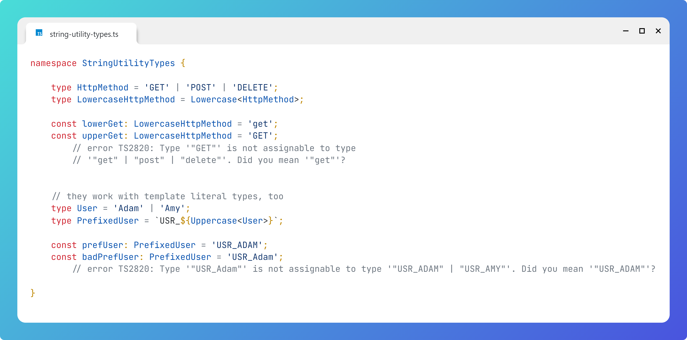

# String Utility Types

## Question

What are string utility types and how can they be used?


## Answer

There are these four string utility types:

```typescript
Uppercase<StringType>
Lowercase<StringType>
Capitalize<StringType>
Uncapitalize<StringType>
```

They can be used to manipulate casing of string types:
```typescript
type HttpMethod = 'GET' | 'POST' | 'DELETE';
type LowercaseHttpMethod = Lowercase<HttpMethod>;

const lowerGet: LowercaseHttpMethod = 'get';
const upperGet: LowercaseHttpMethod = 'GET';
      // error TS2820: Type '"GET"' is not assignable to type 
      // '"get" | "post" | "delete"'. Did you mean '"get"'?        

```

They work with template literal types, too:
```typescript

    type User = 'Adam' | 'Amy';
    type PrefixedUser = `USR_${Uppercase<User>}`;

    const prefUser: PrefixedUser = 'USR_ADAM';
    const badPrefUser: PrefixedUser = 'USR_Adam';
        // error TS2820: Type '"USR_Adam"' is not assignable to type '"USR_ADAM" | "USR_AMY"'. Did you mean '"USR_ADAM"'?
    
```


# Image
