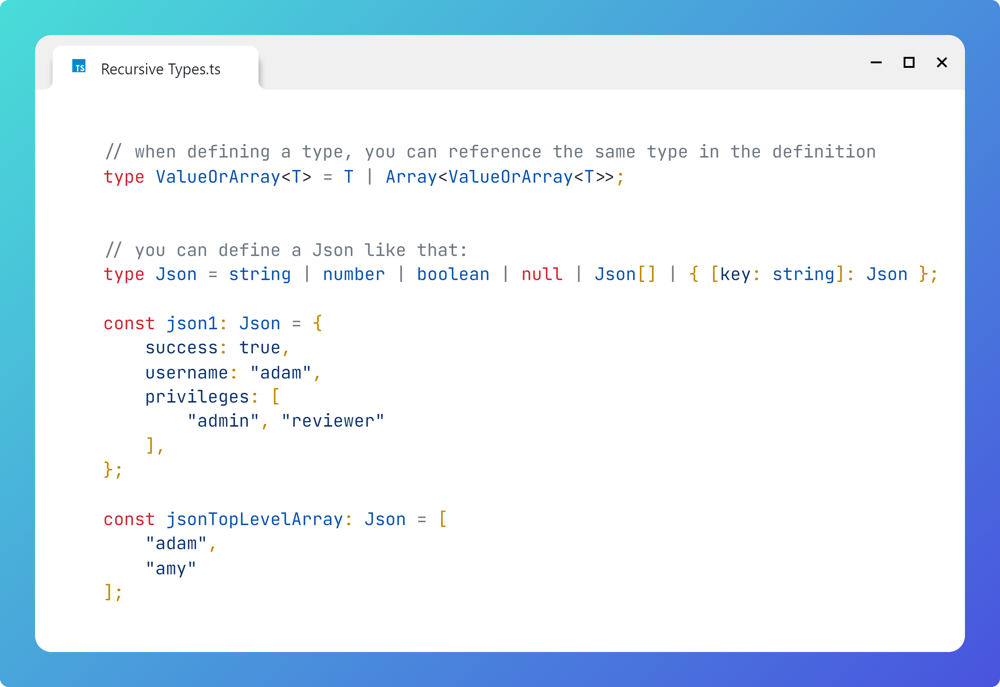

# Recursive Types

## Question

What are recursive types?


## Answer

A recursive type is a type that references itself in its definition, for example:

```typescript
    // when defining a type,  you can reference the same type in the definition
    type ValueOrArray<T> = T | Array<ValueOrArray<T>>;
```


You can define a Json type like that:
```typescript

    type Json = string | number | boolean | null | Json[] | { [key: string]: Json };

    const json1: Json = {
        success: true,
        username: "adam",
        privileges: [
            "admin", "reviewer"
        ],
    };

    const jsonTopLevelArray: Json = [
        "adam",
        "amy"
    ];
```


# Image
